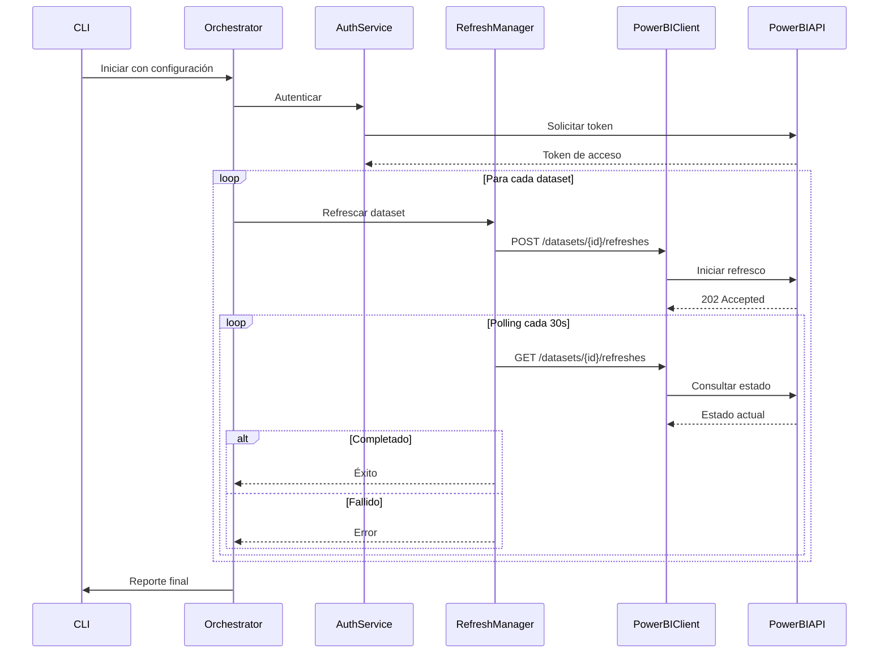

# Documento de Diseño: Power BI Refresh Script

## Overview

Este documento describe el diseño técnico de un script automatizado en Python para refrescar datasets de Power BI mediante la API REST de Power BI. El sistema utiliza autenticación basada en service principal de Azure AD, permitiendo ejecución desatendida en entornos automatizados.

### Objetivos del Diseño

- Proporcionar una solución robusta y confiable para refrescar datasets de Power BI
- Implementar autenticación segura mediante service principal de Azure
- Ofrecer manejo robusto de errores con reintentos inteligentes
- Facilitar la configuración y el monitoreo mediante logging detallado
- Garantizar portabilidad mediante contenedorización con Docker

### Alcance

El sistema cubre:
- Autenticación con Azure AD usando service principal
- Operaciones de refresco de datasets mediante Power BI REST API
- Monitoreo del estado de refrescos en progreso
- Logging estructurado de operaciones y errores
- Configuración flexible mediante archivos y variables de entorno
- Ejecución en contenedores Docker

El sistema NO cubre:
- Interfaz gráfica de usuario
- Programación de tareas (se asume uso de cron, Task Scheduler, etc.)
- Gestión de credenciales (se asume uso de Azure Key Vault u otro sistema externo)

## Architecture

### Arquitectura General

El sistema sigue una arquitectura modular de capas:

```
┌─────────────────────────────────────────────────────────┐
│                    CLI Interface                         │
│              (Argumentos y Configuración)                │
└────────────────────┬────────────────────────────────────┘
                     │
┌────────────────────▼────────────────────────────────────┐
│                 Orchestration Layer                      │
│           (RefreshOrchestrator)                          │
│  - Coordina operaciones de refresco                      │
│  - Gestiona múltiples datasets                           │
│  - Genera reportes de estado                             │
└────────┬───────────────────────────────┬────────────────┘
         │                               │
┌────────▼────────────┐      ┌──────────▼─────────────────┐
│  Authentication     │      │   Refresh Manager          │
│     Service         │      │  - Inicia refrescos        │
│  - Azure AD Auth    │      │  - Monitorea estado        │
│  - Token Management │      │  - Maneja timeouts         │
└────────┬────────────┘      └──────────┬─────────────────┘
         │                               │
         └───────────┬───────────────────┘
                     │
┌────────────────────▼────────────────────────────────────┐
│              Power BI API Client                         │
│  - HTTP client con reintentos                            │
│  - Rate limiting                                         │
│  - Manejo de errores transitorios                        │
└────────────────────┬────────────────────────────────────┘
                     │
┌────────────────────▼────────────────────────────────────┐
│                 Support Services                         │
│  - Logger (consola + archivo)                            │
│  - Config Manager (JSON/YAML + env vars)                 │
│  - Retry Handler (backoff exponencial)                   │
└─────────────────────────────────────────────────────────┘
```

### Flujo de Ejecución Principal



## Components and Interfaces

### 1. CLI Interface (`main.py`)

**Responsabilidad:** Punto de entrada del script, parseo de argumentos y configuración inicial.

**Interfaz:**
```python
def main(args: List[str]) -> int:
    """
    Punto de entrada principal del script.
    
    Args:
        args: Argumentos de línea de comandos
        
    Returns:
        Código de salida (0 = éxito, 1 = error)
    """
```

**Argumentos soportados:**
- `--config`: Ruta al archivo de configuración (JSON/YAML)
- `--workspace-id`: ID del workspace (puede repetirse)
- `--dataset-id`: ID del dataset (puede repetirse)
- `--log-level`: Nivel de logging (DEBUG, INFO, WARNING, ERROR)
- `--log-file`: Ruta al archivo de log
- `--output-format`: Formato de salida (text, json)

### 2. Configuration Manager (`config.py`)

**Responsabilidad:** Carga y validación de configuración desde múltiples fuentes.

**Interfaz:**
```python
@dataclass
class Config:
    """Configuración del script."""
    tenant_id: str
    client_id: str
    client_secret: str
    workspace_ids: List[str]
    dataset_ids: Optional[List[str]]
    poll_interval: int = 30
    max_retries: int = 3
    retry_backoff: List[int] = field(default_factory=lambda: [5, 10, 20])
    log_level: str = "INFO"
    log_file: Optional[str] = None
    timeout: int = 3600

class ConfigManager:
    """Gestiona la carga y validación de configuración."""
    
    @staticmethod
    def load(config_path: Optional[str] = None, 
             cli_args: Optional[Dict] = None) -> Config:
        """
        Carga configuración desde archivo y variables de entorno.
        Los argumentos CLI tienen prioridad sobre archivo, 
        que tiene prioridad sobre variables de entorno.
        """
    
    @staticmethod
    def validate(config: Config) -> List[str]:
        """
        Valida la configuración y retorna lista de errores.
        Retorna lista vacía si la configuración es válida.
        """
```

### 3. Authentication Service (`auth.py`)

**Responsabilidad:** Autenticación con Azure AD y gestión de tokens de acceso.

**Interfaz:**
```python
class AuthenticationService:
    """Servicio de autenticación con Azure AD."""
    
    def __init__(self, tenant_id: str, client_id: str, client_secret: str):
        """Inicializa el servicio con credenciales del service principal."""
    
    def get_access_token(self) -> str:
        """
        Obtiene un token de acceso válido para Power BI API.
        Cachea el token y lo renueva automáticamente cuando expira.
        
        Returns:
            Token de acceso JWT
            
        Raises:
            AuthenticationError: Si la autenticación falla
        """
    
    def is_token_valid(self) -> bool:
        """Verifica si el token actual es válido."""
```

### 4. Power BI API Client (`powerbi_client.py`)

**Responsabilidad:** Cliente HTTP para interactuar con Power BI REST API.

**Interfaz:**
```python
class PowerBIClient:
    """Cliente para Power BI REST API."""
    
    def __init__(self, auth_service: AuthenticationService, 
                 retry_handler: RetryHandler):
        """Inicializa el cliente con servicio de autenticación."""
    
    def list_datasets(self, workspace_id: str) -> List[Dict]:
        """
        Lista todos los datasets en un workspace.
        
        Args:
            workspace_id: ID del workspace
            
        Returns:
            Lista de datasets con id, name, y otros metadatos
            
        Raises:
            PowerBIAPIError: Si la operación falla
            PermissionError: Si no hay permisos en el workspace
        """
    
    def start_refresh(self, workspace_id: str, dataset_id: str) -> str:
        """
        Inicia el refresco de un dataset.
        
        Args:
            workspace_id: ID del workspace
            dataset_id: ID del dataset
            
        Returns:
            ID de la solicitud de refresco
            
        Raises:
            PowerBIAPIError: Si la operación falla
        """
    
    def get_refresh_status(self, workspace_id: str, 
                          dataset_id: str, 
                          refresh_id: str) -> RefreshStatus:
        """
        Obtiene el estado de un refresco en progreso.
        
        Returns:
            Estado del refresco (Unknown, InProgress, Completed, Failed)
        """
```

### 5. Refresh Manager (`refresh_manager.py`)

**Responsabilidad:** Gestiona el ciclo de vida de operaciones de refresco.

**Interfaz:**
```python
@dataclass
class RefreshResult:
    """Resultado de una operación de refresco."""
    dataset_id: str
    dataset_name: str
    workspace_id: str
    success: bool
    duration: float
    error_message: Optional[str] = None
    start_time: datetime = field(default_factory=datetime.now)
    end_time: Optional[datetime] = None

class RefreshManager:
    """Gestiona operaciones de refresco de datasets."""
    
    def __init__(self, client: PowerBIClient, 
                 poll_interval: int = 30,
                 timeout: int = 3600):
        """Inicializa el gestor con cliente de Power BI."""
    
    def refresh_dataset(self, workspace_id: str, 
                       dataset_id: str) -> RefreshResult:
        """
        Refresca un dataset y espera a que complete.
        
        Args:
            workspace_id: ID del workspace
            dataset_id: ID del dataset
            
        Returns:
            Resultado del refresco con éxito/fallo y detalles
        """
    
    def _poll_refresh_status(self, workspace_id: str, 
                            dataset_id: str, 
                            refresh_id: str) -> RefreshStatus:
        """
        Monitorea el estado del refresco hasta que complete o falle.
        Implementa polling con intervalo configurable.
        """
```

### 6. Refresh Orchestrator (`orchestrator.py`)

**Responsabilidad:** Coordina el refresco de múltiples datasets y genera reportes.

**Interfaz:**
```python
@dataclass
class ExecutionSummary:
    """Resumen de ejecución del script."""
    total_datasets: int
    successful: int
    failed: int
    total_duration: float
    results: List[RefreshResult]
    
    def to_dict(self) -> Dict:
        """Convierte el resumen a diccionario para serialización."""
    
    def to_text(self) -> str:
        """Genera reporte en formato texto legible."""

class RefreshOrchestrator:
    """Orquesta el refresco de múltiples datasets."""
    
    def __init__(self, config: Config, 
                 refresh_manager: RefreshManager,
                 logger: Logger):
        """Inicializa el orquestador con configuración."""
    
    def execute(self) -> ExecutionSummary:
        """
        Ejecuta el refresco de todos los datasets configurados.
        
        Returns:
            Resumen de ejecución con resultados de todos los refrescos
        """
```

### 7. Retry Handler (`retry.py`)

**Responsabilidad:** Implementa lógica de reintentos con backoff exponencial.

**Interfaz:**
```python
class RetryHandler:
    """Maneja reintentos con backoff exponencial."""
    
    def __init__(self, max_retries: int = 3, 
                 backoff_delays: List[int] = [5, 10, 20]):
        """Inicializa con configuración de reintentos."""
    
    def execute_with_retry(self, 
                          func: Callable, 
                          *args, 
                          **kwargs) -> Any:
        """
        Ejecuta una función con reintentos automáticos.
        
        Args:
            func: Función a ejecutar
            *args, **kwargs: Argumentos para la función
            
        Returns:
            Resultado de la función
            
        Raises:
            Exception: Si todos los reintentos fallan
        """
    
    def should_retry(self, exception: Exception) -> bool:
        """
        Determina si una excepción es reintentable.
        Retorna True para errores de red, timeouts, y errores 5xx.
        """
    
    def handle_rate_limit(self, retry_after: int):
        """Maneja respuestas 429 esperando el tiempo indicado."""
```

### 8. Logger (`logger.py`)

**Responsabilidad:** Logging estructurado a consola y archivo.

**Interfaz:**
```python
class ScriptLogger:
    """Logger configurado para el script."""
    
    @staticmethod
    def setup(log_level: str = "INFO", 
             log_file: Optional[str] = None) -> Logger:
        """
        Configura el logger con handlers para consola y archivo.
        
        Args:
            log_level: Nivel de logging (DEBUG, INFO, WARNING, ERROR)
            log_file: Ruta opcional al archivo de log
            
        Returns:
            Logger configurado
        """
```

## Data Models

### Enumeraciones

```python
from enum import Enum

class RefreshStatus(Enum):
    """Estados posibles de un refresco."""
    UNKNOWN = "Unknown"
    IN_PROGRESS = "InProgress"
    COMPLETED = "Completed"
    FAILED = "Failed"

class LogLevel(Enum):
    """Niveles de logging."""
    DEBUG = "DEBUG"
    INFO = "INFO"
    WARNING = "WARNING"
    ERROR = "ERROR"
```

### Excepciones Personalizadas

```python
class PowerBIScriptError(Exception):
    """Excepción base para errores del script."""
    pass

class AuthenticationError(PowerBIScriptError):
    """Error de autenticación con Azure AD."""
    pass

class PowerBIAPIError(PowerBIScriptError):
    """Error al interactuar con Power BI API."""
    def __init__(self, message: str, status_code: int, response_body: str):
        super().__init__(message)
        self.status_code = status_code
        self.response_body = response_body

class ConfigurationError(PowerBIScriptError):
    """Error en la configuración del script."""
    pass

class PermissionError(PowerBIScriptError):
    """Error de permisos en workspace o dataset."""
    pass

class RefreshTimeoutError(PowerBIScriptError):
    """El refresco excedió el tiempo máximo de espera."""
    pass
```

### Modelos de Datos

```python
@dataclass
class Dataset:
    """Representa un dataset de Power BI."""
    id: str
    name: str
    workspace_id: str
    configured_by: Optional[str] = None
    is_refreshable: bool = True

@dataclass
class Workspace:
    """Representa un workspace de Power BI."""
    id: str
    name: str
    type: str  # "Workspace" o "Group"

@dataclass
class RefreshRequest:
    """Solicitud de refresco."""
    workspace_id: str
    dataset_id: str
    request_id: str
    start_time: datetime
    
@dataclass
class RefreshHistory:
    """Historial de un refresco."""
    refresh_id: str
    status: RefreshStatus
    start_time: datetime
    end_time: Optional[datetime]
    error_message: Optional[str]
```

### Estructura de Configuración (JSON/YAML)

```json
{
  "azure": {
    "tenant_id": "${AZURE_TENANT_ID}",
    "client_id": "${AZURE_CLIENT_ID}",
    "client_secret": "${AZURE_CLIENT_SECRET}"
  },
  "powerbi": {
    "workspaces": [
      {
        "id": "workspace-guid-1",
        "datasets": ["dataset-guid-1", "dataset-guid-2"]
      },
      {
        "id": "workspace-guid-2",
        "datasets": []
      }
    ]
  },
  "execution": {
    "poll_interval": 30,
    "timeout": 3600,
    "max_retries": 3,
    "retry_backoff": [5, 10, 20]
  },
  "logging": {
    "level": "INFO",
    "file": "powerbi_refresh.log",
    "format": "%(asctime)s - %(name)s - %(levelname)s - %(message)s"
  }
}
```


## Correctness Properties

*Una propiedad es una característica o comportamiento que debe mantenerse verdadero en todas las ejecuciones válidas de un sistema - esencialmente, una declaración formal sobre lo que el sistema debe hacer. Las propiedades sirven como puente entre las especificaciones legibles por humanos y las garantías de correctitud verificables por máquinas.*

### Reflexión sobre Propiedades

Después de analizar los 35 criterios de aceptación, he identificado las siguientes propiedades testables. He realizado una reflexión para eliminar redundancias:

**Propiedades Consolidadas:**
- Las propiedades 2.3 y 2.4 (registro de éxito/fallo) se pueden consolidar en una propiedad más general sobre registro de resultados
- Las propiedades 9.1, 9.2, 9.3 se pueden consolidar en una propiedad sobre completitud del resumen
- Las propiedades 4.1 y 4.5 (registro con timestamp y duración) se pueden consolidar en una propiedad sobre estructura de logs

**Propiedades Eliminadas por Redundancia:**
- La propiedad 1.3 (leer credenciales) está implícita en 1.1 (autenticación exitosa)
- La propiedad 3.1 (aceptar workspace IDs) está implícita en 3.2 (validar acceso)

### Property 1: Autenticación con credenciales válidas

*Para cualquier* conjunto de credenciales válidas de service principal (tenant_id, client_id, client_secret), el script debe autenticarse exitosamente con la Power BI API y obtener un token de acceso válido.

**Validates: Requirements 1.1**

### Property 2: Rechazo de credenciales inválidas

*Para cualquier* conjunto de credenciales inválidas o malformadas, el script debe retornar un error de autenticación descriptivo que indique claramente el problema sin exponer información sensible.

**Validates: Requirements 1.2**

### Property 3: Inicio de refresco para datasets válidos

*Para cualquier* workspace ID y dataset ID válidos, cuando se solicita un refresco, el script debe iniciar exitosamente la operación de refresco en la Power BI API.

**Validates: Requirements 2.1**

### Property 4: Registro de resultados de refresco

*Para cualquier* operación de refresco completada (exitosa o fallida), el script debe registrar el resultado con timestamp, estado final, y mensaje descriptivo (mensaje de error en caso de fallo).

**Validates: Requirements 2.3, 2.4**

### Property 5: Procesamiento de múltiples datasets

*Para cualquier* lista no vacía de datasets, el script debe procesar todos los datasets en la lista, independientemente de si algunos fallan, y retornar resultados para cada uno.

**Validates: Requirements 2.5**

### Property 6: Validación de permisos en workspace

*Para cualquier* workspace ID proporcionado, el script debe validar que el service principal tiene permisos de acceso antes de intentar operaciones, y retornar un error descriptivo si no tiene permisos.

**Validates: Requirements 3.2, 3.3**

### Property 7: Listado completo de datasets

*Para cualquier* workspace al que el service principal tenga acceso, cuando se solicita listar datasets, el script debe retornar todos los datasets disponibles en ese workspace.

**Validates: Requirements 3.4**

### Property 8: Estructura de logs completa

*Para cualquier* operación registrada, el log debe contener timestamp, nivel de severidad (DEBUG/INFO/WARNING/ERROR), y mensaje descriptivo.

**Validates: Requirements 4.1**

### Property 9: Stack trace en errores

*Para cualquier* excepción o error capturado, el log debe incluir el stack trace completo para facilitar el diagnóstico.

**Validates: Requirements 4.2**

### Property 10: Respeto de nivel de logging

*Para cualquier* nivel de logging configurado (DEBUG, INFO, WARNING, ERROR), el script debe registrar solo mensajes de ese nivel o superior, filtrando mensajes de niveles inferiores.

**Validates: Requirements 4.3**

### Property 11: Registro de duración de refrescos

*Para cualquier* refresco completado, el log debe incluir el tiempo total de ejecución del refresco en segundos o formato legible.

**Validates: Requirements 4.5**

### Property 12: Reintentos en errores transitorios

*Para cualquier* error de red transitorio (timeout, conexión rechazada, error 5xx), el script debe reintentar la operación hasta el número máximo de reintentos configurado antes de fallar definitivamente.

**Validates: Requirements 6.1**

### Property 13: Continuación tras fallos de reintentos

*Para cualquier* operación que falle después de agotar todos los reintentos, el script debe registrar el error final y continuar procesando los siguientes datasets en lugar de terminar la ejecución completa.

**Validates: Requirements 6.3**

### Property 14: Respeto de Retry-After en rate limiting

*Para cualquier* respuesta HTTP 429 (rate limit) de la Power BI API que incluya el header Retry-After, el script debe esperar al menos el tiempo especificado en ese header antes de reintentar.

**Validates: Requirements 6.4**

### Property 15: Carga de configuración desde múltiples formatos

*Para cualquier* archivo de configuración válido en formato JSON o YAML que contenga los campos requeridos, el script debe cargar exitosamente la configuración.

**Validates: Requirements 7.1**

### Property 16: Precedencia de argumentos CLI

*Para cualquier* parámetro de configuración que esté presente tanto en archivo de configuración como en argumentos de línea de comandos, el valor del argumento CLI debe tener precedencia y ser el utilizado.

**Validates: Requirements 7.2**

### Property 17: Validación de configuración requerida

*Para cualquier* configuración que carezca de campos obligatorios (tenant_id, client_id, client_secret, workspace_ids), el script debe fallar al inicio con un error descriptivo que indique exactamente qué campos faltan.

**Validates: Requirements 7.3**

### Property 18: Completitud del resumen de ejecución

*Para cualquier* ejecución completada del script, el resumen final debe incluir: total de datasets procesados, número de exitosos, número de fallidos, y tiempo total de ejecución.

**Validates: Requirements 9.1, 9.2, 9.3**

### Property 19: Detalles de datasets fallidos en resumen

*Para cualquier* dataset que falle durante la ejecución, el resumen final debe incluir el nombre del dataset y el motivo específico del fallo.

**Validates: Requirements 9.4**

### Property 20: Serialización JSON del resumen

*Para cualquier* resumen de ejecución, cuando se configura salida en formato JSON, serializar y deserializar el resumen debe producir un objeto equivalente con todos los campos preservados (round-trip).

**Validates: Requirements 9.5**

## Error Handling

### Estrategia General de Manejo de Errores

El sistema implementa una estrategia de manejo de errores en capas:

1. **Capa de Validación**: Errores de configuración y validación se detectan al inicio
2. **Capa de Autenticación**: Errores de autenticación se manejan con reintentos limitados
3. **Capa de API**: Errores de API se clasifican en reintentables y no reintentables
4. **Capa de Orquestación**: Errores individuales no detienen el procesamiento completo

### Tipos de Errores y Manejo

#### 1. Errores de Configuración

**Detección:** Al inicio de la ejecución, antes de cualquier operación.

**Manejo:**
- Validar presencia de campos obligatorios
- Validar formato de IDs (GUIDs)
- Validar rangos de valores numéricos (timeouts, intervalos)
- Terminar ejecución inmediatamente con código de salida 1
- Mostrar mensaje claro indicando el problema específico

**Ejemplo:**
```
ERROR: Configuración inválida
- Falta campo obligatorio: tenant_id
- Valor inválido para poll_interval: debe ser > 0
```

#### 2. Errores de Autenticación

**Detección:** Al intentar obtener token de acceso de Azure AD.

**Manejo:**
- Reintentar hasta 3 veces con backoff exponencial
- Distinguir entre credenciales inválidas (no reintentar) y errores de red (reintentar)
- Registrar cada intento fallido
- Terminar ejecución si todos los reintentos fallan
- No exponer credenciales en logs

**Códigos de error manejados:**
- 401 Unauthorized: Credenciales inválidas (no reintentar)
- 403 Forbidden: Permisos insuficientes (no reintentar)
- 5xx: Error del servidor (reintentar)
- Timeout: Error de red (reintentar)

#### 3. Errores de Permisos

**Detección:** Al intentar acceder a workspace o dataset.

**Manejo:**
- No reintentar (los permisos no cambiarán durante la ejecución)
- Registrar error con detalles del recurso
- Continuar con siguiente dataset/workspace
- Incluir en resumen final

**Ejemplo:**
```
ERROR: Sin permisos en workspace 'Sales Analytics' (id: abc-123)
El service principal debe tener rol de Member o Admin en el workspace
```

#### 4. Errores de API Transitorios

**Detección:** Respuestas HTTP 5xx, timeouts, errores de conexión.

**Manejo:**
- Reintentar hasta 3 veces con backoff exponencial (5s, 10s, 20s)
- Registrar cada intento
- Si todos fallan, marcar operación como fallida y continuar
- Incluir en resumen final

**Códigos manejados:**
- 500 Internal Server Error: Reintentar
- 502 Bad Gateway: Reintentar
- 503 Service Unavailable: Reintentar
- 504 Gateway Timeout: Reintentar
- ConnectionError: Reintentar
- Timeout: Reintentar

#### 5. Rate Limiting (429)

**Detección:** Respuesta HTTP 429 Too Many Requests.

**Manejo:**
- Leer header `Retry-After` de la respuesta
- Esperar el tiempo indicado (o 60s si no se especifica)
- Reintentar la operación
- No contar como intento fallido en el límite de reintentos
- Registrar el evento de rate limiting

**Ejemplo:**
```
WARNING: Rate limit alcanzado. Esperando 60 segundos antes de reintentar...
```

#### 6. Errores de Refresco

**Detección:** Dataset refresh falla según Power BI API.

**Manejo:**
- Obtener mensaje de error detallado de la API
- Registrar error con contexto (workspace, dataset, timestamp)
- No reintentar (el refresco ya fue procesado por Power BI)
- Marcar como fallido en resumen
- Continuar con siguiente dataset

**Información registrada:**
- ID y nombre del dataset
- ID del workspace
- Mensaje de error de Power BI
- Timestamp de inicio y fin
- Duración del intento

#### 7. Timeouts de Refresco

**Detección:** Refresco excede el timeout configurado (default: 3600s).

**Manejo:**
- Detener polling del estado
- Registrar timeout con duración
- Marcar como fallido en resumen
- Continuar con siguiente dataset
- No cancelar el refresco en Power BI (puede completarse después)

**Ejemplo:**
```
ERROR: Timeout esperando refresco de dataset 'Sales Data'
Tiempo transcurrido: 3600s
El refresco puede continuar en Power BI, verificar manualmente
```

#### 8. Errores Inesperados

**Detección:** Excepciones no capturadas específicamente.

**Manejo:**
- Capturar en nivel superior del orquestador
- Registrar excepción completa con stack trace
- Intentar completar resumen parcial
- Terminar con código de salida 1
- Preservar información de datasets ya procesados

### Logging de Errores

Todos los errores se registran con:
- Timestamp ISO 8601
- Nivel ERROR
- Contexto completo (workspace, dataset, operación)
- Stack trace (para excepciones)
- Mensaje descriptivo para el usuario

### Códigos de Salida

- `0`: Ejecución exitosa (todos los refrescos completados)
- `1`: Error fatal (configuración inválida, autenticación fallida)
- `2`: Ejecución parcial (algunos refrescos fallaron, pero el script completó)

## Testing Strategy

### Enfoque Dual de Testing

El proyecto implementará dos tipos complementarios de pruebas:

1. **Unit Tests**: Verifican ejemplos específicos, casos borde y condiciones de error
2. **Property-Based Tests**: Verifican propiedades universales a través de múltiples entradas generadas

Ambos tipos son necesarios para cobertura completa:
- Los unit tests capturan bugs concretos y casos específicos
- Los property tests verifican correctitud general y descubren casos no anticipados

### Herramientas de Testing

**Framework de Testing:** `pytest`
- Framework estándar de Python con excelente soporte para fixtures y mocking
- Plugins disponibles para cobertura y reporting

**Property-Based Testing:** `hypothesis`
- Biblioteca líder para property-based testing en Python
- Genera automáticamente casos de prueba diversos
- Shrinking automático para encontrar casos mínimos que fallan
- Configuración: mínimo 100 iteraciones por propiedad

**Mocking:** `unittest.mock` y `responses`
- Mock de llamadas HTTP a Power BI API
- Mock de autenticación con Azure AD
- Simulación de diferentes respuestas de API

### Estructura de Tests

```
tests/
├── unit/
│   ├── test_config.py
│   ├── test_auth.py
│   ├── test_powerbi_client.py
│   ├── test_refresh_manager.py
│   ├── test_orchestrator.py
│   ├── test_retry.py
│   └── test_logger.py
├── property/
│   ├── test_properties_auth.py
│   ├── test_properties_refresh.py
│   ├── test_properties_config.py
│   ├── test_properties_logging.py
│   └── test_properties_summary.py
├── integration/
│   └── test_end_to_end.py
├── fixtures/
│   ├── config_examples.py
│   └── api_responses.py
└── conftest.py
```

### Property-Based Tests

Cada propiedad de correctitud debe implementarse como un property test con:

**Configuración mínima:**
```python
from hypothesis import given, settings
import hypothesis.strategies as st

@settings(max_examples=100)  # Mínimo 100 iteraciones
@given(...)
def test_property_X(...):
    """
    Feature: powerbi-refresh-script, Property X: [texto de la propiedad]
    """
    # Implementación del test
```

**Estrategias de generación (Hypothesis strategies):**

```python
# Generadores para el dominio de Power BI
@st.composite
def valid_guid(draw):
    """Genera GUIDs válidos para IDs de workspace/dataset."""
    return str(uuid.uuid4())

@st.composite
def valid_credentials(draw):
    """Genera credenciales válidas de service principal."""
    return {
        'tenant_id': draw(valid_guid()),
        'client_id': draw(valid_guid()),
        'client_secret': draw(st.text(min_size=32, max_size=64))
    }

@st.composite
def invalid_credentials(draw):
    """Genera credenciales inválidas de diversas formas."""
    return draw(st.one_of(
        st.just({}),  # Vacío
        st.just({'tenant_id': 'invalid'}),  # GUID inválido
        st.just({'tenant_id': '', 'client_id': '', 'client_secret': ''}),  # Vacíos
    ))

@st.composite
def dataset_list(draw):
    """Genera listas de datasets con IDs válidos."""
    count = draw(st.integers(min_value=1, max_value=10))
    return [draw(valid_guid()) for _ in range(count)]

@st.composite
def config_dict(draw):
    """Genera diccionarios de configuración válidos."""
    return {
        'azure': draw(valid_credentials()),
        'powerbi': {
            'workspaces': draw(st.lists(
                st.builds(dict, 
                    id=valid_guid(),
                    datasets=dataset_list()
                ),
                min_size=1,
                max_size=5
            ))
        },
        'execution': {
            'poll_interval': draw(st.integers(min_value=10, max_value=120)),
            'timeout': draw(st.integers(min_value=300, max_value=7200)),
            'max_retries': draw(st.integers(min_value=1, max_value=5))
        }
    }
```

### Unit Tests - Casos Específicos

**Ejemplos de unit tests importantes:**

1. **Configuración:**
   - Cargar archivo JSON de ejemplo
   - Cargar archivo YAML de ejemplo
   - Variables de entorno sobrescriben archivo
   - Argumentos CLI sobrescriben todo
   - Error descriptivo cuando falta tenant_id
   - Error descriptivo cuando falta client_id

2. **Autenticación:**
   - Autenticación exitosa con credenciales válidas
   - Fallo con credenciales inválidas
   - Fallo después de exactamente 3 intentos
   - Token se cachea y reutiliza
   - Token se renueva cuando expira

3. **Reintentos:**
   - Backoff exponencial con tiempos exactos [5s, 10s, 20s]
   - Reintentar en error 500
   - Reintentar en error 502
   - Reintentar en error 503
   - No reintentar en error 401
   - No reintentar en error 403
   - Esperar tiempo de Retry-After en error 429

4. **Logging:**
   - Logs se escriben a consola y archivo simultáneamente
   - Nivel DEBUG muestra todos los mensajes
   - Nivel ERROR solo muestra errores
   - Stack trace completo en excepciones

5. **Resumen:**
   - Resumen en formato texto es legible
   - Resumen en formato JSON es válido
   - Resumen incluye todos los campos requeridos

### Integration Tests

**Test end-to-end con mocks:**
```python
def test_full_execution_with_mixed_results(mock_powerbi_api):
    """
    Test de integración que simula una ejecución completa con:
    - 3 datasets: 2 exitosos, 1 fallido
    - Autenticación exitosa
    - Un reintento por error transitorio
    - Resumen final correcto
    """
    # Setup mocks
    # Execute script
    # Verify summary
```

### Cobertura de Testing

**Objetivos de cobertura:**
- Cobertura de líneas: > 85%
- Cobertura de branches: > 80%
- Todas las propiedades de correctitud: 100% implementadas

**Áreas críticas (requieren 100% cobertura):**
- Manejo de errores y reintentos
- Validación de configuración
- Lógica de autenticación
- Generación de resumen

### Ejecución de Tests

**Comandos:**
```bash
# Todos los tests
pytest

# Solo unit tests
pytest tests/unit/

# Solo property tests
pytest tests/property/

# Con cobertura
pytest --cov=powerbi_refresh --cov-report=html

# Tests específicos con verbose
pytest tests/property/test_properties_auth.py -v

# Property tests con más ejemplos
pytest tests/property/ --hypothesis-show-statistics
```

### CI/CD Integration

Los tests deben ejecutarse en:
- Cada commit (unit tests)
- Cada pull request (unit + property tests)
- Nightly builds (property tests con 1000 iteraciones)

**GitHub Actions workflow ejemplo:**
```yaml
name: Tests
on: [push, pull_request]
jobs:
  test:
    runs-on: ubuntu-latest
    steps:
      - uses: actions/checkout@v2
      - uses: actions/setup-python@v2
        with:
          python-version: '3.9'
      - run: pip install -r requirements-dev.txt
      - run: pytest --cov --cov-report=xml
      - uses: codecov/codecov-action@v2
```

